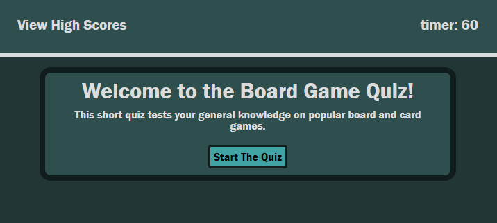
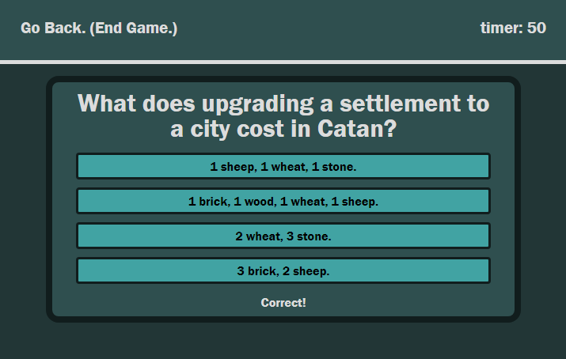
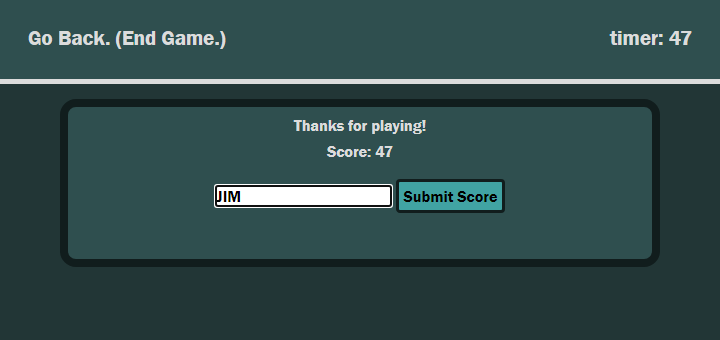
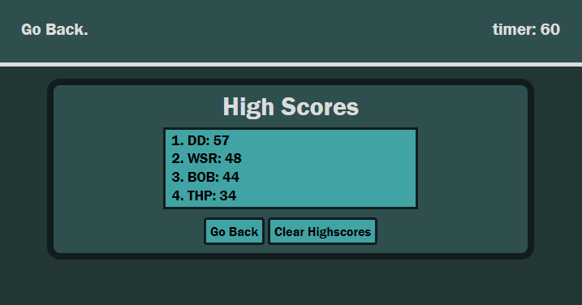

# Board Game Quiz

## Description

A project for my bootcamp to create a short quiz game website. The game asks a series  board and card game multiple-choice questions. There is a 60 second time limit, and every wrong answer removes 10 seconds off the clock. At the end of the game, your score is your remaining time.

The game also features a scoreboard that will persist between sessions, that if needed can be erased and a randomizer built-in to change the order the answers will appear in each time the question is loaded.

## Changing the Questions

To change the questions, open the file `quiz.js` and find the variable `quizQuestions`. This is an array of arrays, with each internal array being 5 slots. The first slot is the question, the second slot is the correct answer, and the other 3 slots are the wrong answers. You can add these 5 slot arrays to the larger array or remove/change them as needed. The questions will appear in the order you put them in in the larger array.

## Used Tech

- HTML
- CSS
- JS

## Webpage Link

[Please click here to view the webpage.](https://wruback.github.io/WR-quiz-game/)

## Webpage Appearance

## Contributors

 - William Ruback - wrubackdev@gmail.com

## License

>MIT License
>
>Copyright (c) 2022 William Ruback
>
>Permission is hereby granted, free of charge, to any person obtaining a copy
of this software and associated documentation files (the "Software"), to deal
in the Software without restriction, including without limitation the rights
to use, copy, modify, merge, publish, distribute, sublicense, and/or sell
copies of the Software, and to permit persons to whom the Software is
furnished to do so, subject to the following conditions:
>
>The above copyright notice and this permission notice shall be included in all
copies or substantial portions of the Software.
>
>THE SOFTWARE IS PROVIDED "AS IS", WITHOUT WARRANTY OF ANY KIND, EXPRESS OR
IMPLIED, INCLUDING BUT NOT LIMITED TO THE WARRANTIES OF MERCHANTABILITY,
FITNESS FOR A PARTICULAR PURPOSE AND NONINFRINGEMENT. IN NO EVENT SHALL THE
AUTHORS OR COPYRIGHT HOLDERS BE LIABLE FOR ANY CLAIM, DAMAGES OR OTHER
LIABILITY, WHETHER IN AN ACTION OF CONTRACT, TORT OR OTHERWISE, ARISING FROM,
OUT OF OR IN CONNECTION WITH THE SOFTWARE OR THE USE OR OTHER DEALINGS IN THE
SOFTWARE.
